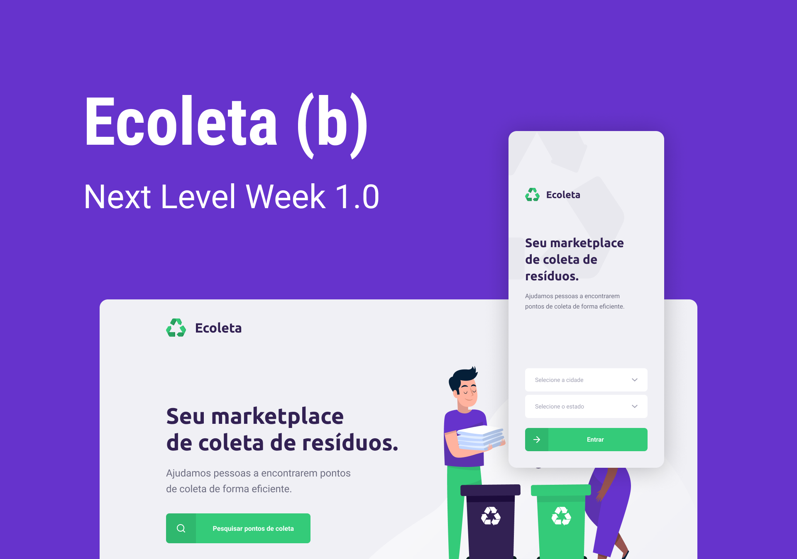

<h1 align="center">
	
</h1>

<h3 align="center">
  Seu marketplace de coleta de resíduos.
</h3>

<p align="center">
  

  

  <a href="https://www.linkedin.com/in/brunofarias82/">
    
  </a>
  
  
  
  <a href="https://github.com/brunofarias/ecoleta/commits/master">
    
  </a>
  
  <a href="https://github.com/brunofarias/ecoleta/issues">
    
  </a>
</p>

<p align="center">
  <a href="#-sobre-o-projeto">Sobre o projeto</a>&nbsp;&nbsp;&nbsp;|&nbsp;&nbsp;&nbsp;
  <a href="#-tecnologias">Tecnologias</a>&nbsp;&nbsp;&nbsp;|&nbsp;&nbsp;&nbsp;
  <a href="#-Iniciando">Iniciando</a>&nbsp;&nbsp;&nbsp;|&nbsp;&nbsp;&nbsp;
  <a href="#-como-contribuir">Como contribuir</a>&nbsp;&nbsp;&nbsp;|&nbsp;&nbsp;&nbsp;
  <a href="#-autor">Autor</a>
</p>

<p align="center">  
  
</p>

## 👨🏻‍💻 Sobre o projeto

Ecoleta é um projeto desenvolvido com base na semana internacional do meio ambiente. O objetivo é conectar pessoas a empresas que coletam resíduos específicos, como lâmpadas, baterias, óleo de cozinha etc.

As empresas ou entidades poderão se cadastrar na plataforma web enviando:
- Uma imagem do ponto de coleta
- Nome da entidade, email e whatsapp
- Endereço para que ele possa aparecer no mapa
- Selecionar um ou mais ítens de coleta: 
  - lâmpadas
  - pilhas e baterias
  - papéis e papelão
  - resíduos eletrônicos
  - resíduos orgânicos
  - óleo de cozinha

Os usuários terão acesso ao aplicativo móvel, onde poderão:
- Navegar pelo mapa para ver as instituições cadastradas
- Entrar em contato com a entidade através do E-mail ou do WhatsApp

Projeto desenvolvido durante a **NLW - Next Level Week** oferecida pela Rocketseat.

## 🚀 Tecnologias

Tecnologias utilizadas para desenvolver a aplicação:

- [Node.js](https://nodejs.org/en/)
- [ReactJS](https://reactjs.org/)
- [TypeScript](https://www.typescriptlang.org/)
- [React Native](https://reactnative.dev/)
- [Leaflet](https://leafletjs.com/)
- [Expo](https://expo.io/)
- [Express](https://expressjs.com/pt-br/)
- [SQLite](https://www.sqlite.org/)
- [React Router DOM](https://reacttraining.com/react-router/)
- [React Navigation](https://reactnavigation.org/)
- [React Icons](https://react-icons.netlify.com/#/)
- [React Dropzone](https://react-dropzone.js.org/)
- [Axios](https://github.com/axios/axios)
- [Eslint](https://eslint.org/)
- [Prettier](https://prettier.io/)
- [EditorConfig](https://editorconfig.org/)

## 💻 Iniciando

### Requisitos

- [Node.js](https://nodejs.org/en/)
- [Yarn](https://classic.yarnpkg.com/) or [npm](https://www.npmjs.com/)

**Clone o projeto e acesse a pasta**

```bash
$ git clone https://github.com/brunofarias/ecoleta.git && cd ecoleta
```

**Siga os passos abaixo**

### Backend

```bash
# Starting from the project root folder, go to backend folder
$ cd server

# Install the dependencies
$ yarn

# Make sure the keys in 'knexfile.js' to connect with your database
# are set up correctly.
# Once the services are running, run the seeds
$ yarn knex:seed

# Once the services are running, run the migrations
$ yarn knex:migrate

# To finish, run the api service
$ yarn dev

# Well done, project is started!
```

### Web

_Obs.: Antes de continuar, certifique-se que a API está executando_

```bash
# Starting from the project root folder, go to frontend folder
$ cd web

# Install the dependencies
$ yarn

# Be sure the file 'src/services/api.ts' have the IP to your API

# Start the client
$ yarn start
```

### Mobile

_Obs.: Antes de continuar, certifique-se que a API está executando_

```bash
# Starting from the project root folder, go to mobile folder
$ cd mobile

# Install the dependencies
$ yarn

# Be sure the file 'src/services/api.ts' have the IP to your API

# If you are going to emulate with android, run this command
# Be sure to have the emulator open
$ yarn android

# If you are going to emulate with ios, run this command
$ yarn ios
```

## 🤔 Como contribuir

**Crie um fork desse repositório**

```bash
# Fork using GitHub official command line
# If you don't have the GitHub CLI, use the web site to do that.

$ gh repo fork brunofarias/ecoleta
```

**Siga os passos abaixo**

```bash
# Clone your fork
$ git clone your-fork-url && cd ecoleta

# Create a branch with your feature
$ git checkout -b my-feature

# Make the commit with your changes
$ git commit -m 'feat: My new feature'

# Send the code to your remote branch
$ git push origin my-feature
```

Depois que o seu pull request é dado o merge, você pode deletar sua branch.

## ✍️ Autor

👨‍🦱 **Bruno Farias**

- Portfolio: [@brunofarias](https://brunofarias.github.io/)
- Github: [@brunofarias](https://github.com/brunofarias)
- LinkedIn: [@brunofarias82](https://linkedin.com/in/brunofarias82)

Feito com 💚 por Bruno Farias